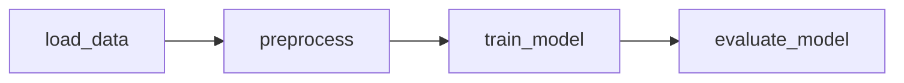

# Breast Cancer ML Pipeline с Apache Airflow

## 📁 Структура проекта

```bash
.
├── data/                     # Сырые данные
├── results/                  # Обработанные данные, модель, метрики
├── dags/                     # DAG-файл Airflow
│   └── pipeline_dag.py
├── etl/                      # Python-функции для этапов
│   ├── __init__.py
│   ├── load_data.py
│   ├── preprocess.py
│   ├── train_model.py
│   └── evaluate_model.py
├── logs/                     # Логи Airflow
├── images/
├── requirements.txt
└── README.md
```

## ❗ Требования

- Python 3.12
- Apache Airflow **v3.x**

> ⚠️ В проекте используется Apache Airflow версии 3. Некоторые команды CLI (например, `airflow webserver`) были удалены или изменены по сравнению с предыдущими версиями.


## Этап 1. Планирование пайплайна

**Формулировка ML-задачи:**  
Цель проекта — построить конвейер машинного обучения (ML pipeline) для классификации опухолей груди (доброкачественная или злокачественная) на основе датасета Breast Cancer Wisconsin.  
Используем модель Logistic Regression и рассчитываем метрики качества классификации.

**Схематичное представление пайплайна:**  


**Краткое описание шагов:**
1. **load_data** — загрузка и сохранение исходного датасета.
2. **preprocess** — очистка, масштабирование признаков и разбиение на выборки.
3. **train_model** — обучение модели логистической регрессии.
4. **evaluate_model** — расчёт метрик и сохранение результатов.

## Этап 2. Разработка ETL-компонентов

Исходный код размещён в директории `etl/`. Каждый скрипт представляет собой отдельную функцию.

- `load_data.py` — функция `save_dataset()` сохраняет датасет breast cancer в CSV (`data/breast_cancer.csv`);
- `preprocess.py` — функция `preprocess()` масштабирует признаки и сохраняет результат в `results/processed.csv`;
- `train_model.py` — функция `train()` обучает логистическую регрессию и сохраняет модель в `results/model.pkl`;
- `evaluate_model.py` — функция `evaluate()` рассчитывает Accuracy, Precision, Recall, F1 и сохраняет метрики в `results/metrics.json`.

Все функции можно запускать автономно или как задачи Airflow.

## Этап 3. Оркестрация пайплайна с помощью Airflow

**DAG:** `ml_pipeline_breast_cancer`

**Задачи:**
1. `load_data` — загрузка breast cancer dataset
2. `preprocess` — очистка, нормализация, разбиение
3. `train_model` — обучение логистической регрессии
4. `evaluate_model` — оценка и сохранение метрик

**Зависимости:**


## Инструкция по запуску

### 1. Установка зависимостей
Создайте виртуальное окружение и установите зависимости:
```bash
python3 -m venv venv
source venv/bin/activate
pip install -r requirements.txt
```

### 2. Настройка переменных окружения
Создайте `.env` файл:
```bash
export RAW_DATA_PATH=data/breast_cancer.csv
export PROCESSED_DATA_PATH=results/processed.csv
export MODEL_PATH=results/model.pkl
export METRICS_PATH=results/metrics.json
# Замените $(pwd) на абсолютный путь к корню проекта
export AIRFLOW_HOME=$(pwd)/airflow_home
export AIRFLOW__CORE__DAGS_FOLDER=$(pwd)/dags
export AIRFLOW__LOGGING__BASE_LOG_FOLDER=$(pwd)/logs
```

Выполните:
```bash
export $(grep -v '^#' .env | xargs)
```

### 3. Запуск Airflow
```bash
airflow standalone
```

После запуска веб-интерфейс будет доступен по адресу:
[http://localhost:8080](http://localhost:8080)

Войти можно с учётными данными, полученными на шаге 3.


---

### Запуск DAG-а вручную

✅ Запустить весь DAG:
```bash
airflow dags trigger ml_pipeline_breast_cancer
```

✅ Проверить список DAG-ов:
```bash
airflow dags list
```

✅ Проверить статус задач:
```bash
airflow tasks list ml_pipeline_breast_cancer
```

## Этап 4. Интеграция с хранилищем

### Локальное хранилище

Результаты работы пайплайна сохраняются **на локальный диск** в подкаталог `results/`.

### Структура каталога `results/`

```text
results/
├── model.pkl         # Обученная модель LogisticRegression 
├── scaler.pkl        # Сохранённый sklearn StandardScaler (pickle)
├── metrics.json      # JSON с метриками качества: Accuracy, Precision, Recall, F1
├── X_train.csv       # Обучающая выборка (признаки)
├── X_test.csv        # Тестовая выборка (признаки)
├── y_train.csv       # Обучающая выборка (целевая переменная)
└── y_test.csv        # Тестовая выборка (целевая переменная) 
```

### Формат данных

- `model.pkl` — Обученная модель **LogisticRegression**
- `scaler.pkl` — Объект **StandardScaler**, использованный для нормализации
- `metrics.json` — JSON-файл с метриками качества
- `metrics.json` — Разделённые данные для обучения и теста


### Авторизация

Интеграция выполнена на локальном диске, авторизация не требуется. Пути к файлам задаются через переменные окружения, например:
```env
MODEL_PATH=results/model.pkl
METRICS_PATH=results/metrics.json
```
## Этап 5. Анализ ошибок и устойчивости

### Потенциальные точки сбоя

| Этап         | Возможные ошибки                          | Обработка                                                                 |
|--------------|-------------------------------------------|---------------------------------------------------------------------------|
| `load_data`  | Источник данных недоступен, поврежден     | Добавлены `retries` и `retry_delay` в Airflow                             |
| `preprocess` | Невалидные данные, NaN, пустой датафрейм  | Внедрена проверка на пустоту и схему данных                               |
| `train_model`| Модель не обучается, `ValueError`         | Исключения логируются, задача может быть перезапущена                     |
| `evaluate_model` | Ошибка в расчете метрик, деление на ноль | Добавлены `try/except`, логирование ошибок                                |

### Устойчивость пайплайна

Каждый шаг пайплайна реализован как независимый `PythonOperator`, задачи изолированы.

**Установленные параметры:**
- `retries=1` — повторная попытка при сбое
- `retry_delay=timedelta(minutes=1)`
- `catchup=False` — не накапливает отставшие DAG-запуски
- Используется логирование: каждый этап выводит статус в консоль и сохраняет в папку `logs/`

**Принципы устойчивости:**
- Ошибки не тянут за собой весь DAG: сбой на этапе `evaluate_model` не влияет на предшествующие шаги

### Пример: устойчивость к сбоям

- **Если загрузка данных с источника не удалась** → повторная попытка (`retry`)
- **Если данные некорректны** (например, NaN) → `preprocess` выбрасывает исключение и пишет лог
- **Если модель не обучается** (например, при нулевом дисперсии признаков) → фиксируется ошибка, можно перезапустить задачу отдельно


